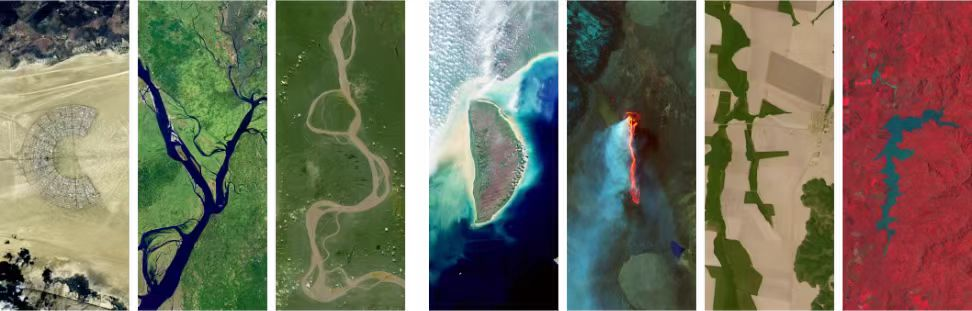
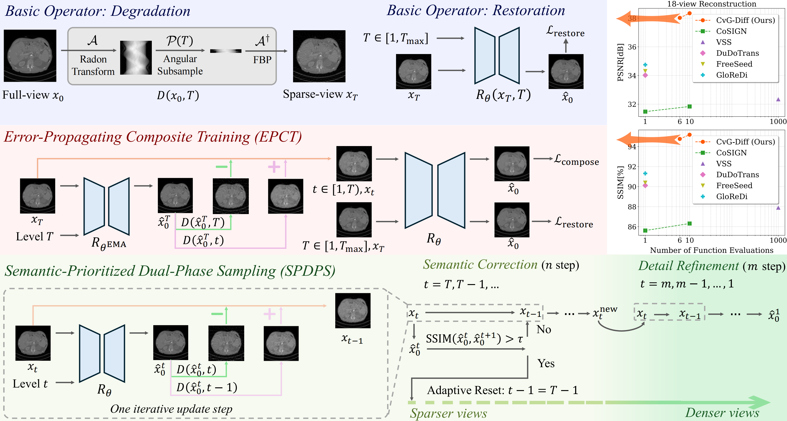
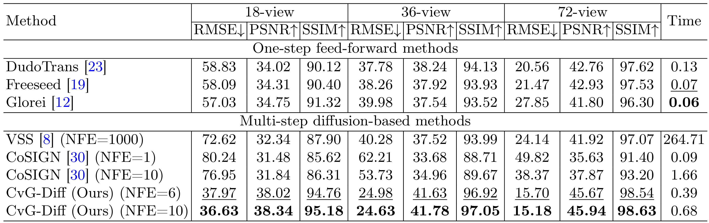
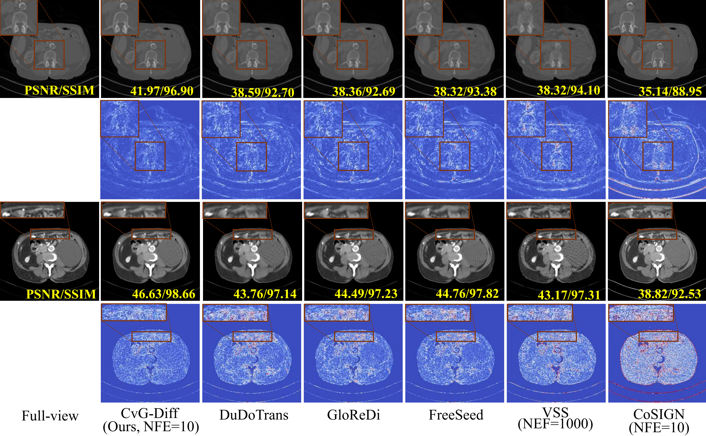

<div align=center>

<h1> Cross-view Generalized Diffusion Model for
 Sparse-view CT Reconstruction </h1>
</div>

<div align=center>
<a src="https://img.shields.io/badge/%F0%9F%93%96-MICCAI_2025-red.svg?style=flat-square" href="https://link.springer.com/chapter/10.1007/978-3-031-72104-5_64">

</a>
   
<a src="https://img.shields.io/badge/%F0%9F%9A%80-xmed_Lab-ed6c00.svg?style=flat-square" href="https://xmengli.github.io/">

</a>
</div>

## :rocket: Updates
- The code of training & test are released.
- The weights of trained models are released. 

## :star: Highlights of CvG-Diff
- CvG-Diff explicit models the angular sparsity artifacts within image-domain as a deterministic degradation process to build a generalied diffusion model. In this way, CvG-Diff harness the simultaneous reconstruction capability across different sparsity regimes, enabling high-quality iterative reconstruction with few sampling steps.
- To better suit the sparsity artifacts in CT images, CvG-Diff integrates: 1) an Error-Propagating Compositve Training (EPCT) strategy to suppress the artifact propagation across different sparsity regimes; 2) a Semantic-Proritized Dual-Phase Sampling (SPDPS) strategy that emphasize overall anatomical structural correctness before detail refinement during iterative sampling. 
- CvG-Diff achieves SoTA performance in sparse-view CT reconstruction across various sparsity levels, enabling few-step high-quality reconstruction.

## :hammer: Environment

- Download the code, create a conda environment, and install the required packages in ``requirements.txt`` by running the following commands:
    ```shell
    git clone https://github.com/xmed-lab/CvG-Diff.git
    cd CvG-Diff
    conda create -n CvG-Diff python=3.7
    conda activate CvG-Diff
    pip install -r ./requirements.txt
    ```

- torch-radon is required for simulating DRRs and geometry utils, install torch-radon by
1. Download torch-radon from [torch-radon](https://github.com/matteo-ronchetti/torch-radon)
    ```shell
    git clone https://github.com/matteo-ronchetti/torch-radon.git
    ```
2. Due to some out-dated Pytorch function in torch-radon, you need to modify code by running
    ```shell
    cd torch-radon
    patch -p1 < path/to/CvG-Diff/torch-radon_fix/torch-radon_fix.patch
    ```
3. Install torch-radon by running
    ```shell
    python setup.py install
    ```
## :computer: Prepare Dataset
- Please download original ``AAPM16`` dataset from [AAPM](https://aapm.app.box.com/s/eaw4jddb53keg1bptavvvd1sf4x3pe9h/folder/144226105715) and process them with code in ``./datasets/preprocess_aapm.py``.

## :key: Train and Evaluate
- We provide the checkpoint of trained CvG-Diff the following links, you can download them for direct inference: [BaiduNetdisk](https://pan.baidu.com/s/1zPDkjhOVrr3ZWjRuaogDQg?pwd=cvgd);  [Huggingface](https://huggingface.co/HajihajihaJimmy/CvG-Diff).
- Run training:
  Open the ``train.sh`` file and config your dataset path and result directory properly, then run
    ```cmd
    train.sh
    ```
- Run evaluation:
  Open the ``test.sh`` file and config your dataset path and result directory properly, then run
    ```cmd
    test.sh
    ```

## :blue_book: Results




## :books: Citation
If you find our paper helps you, please kindly cite our paper in your publications.
```text
@inproceedings{chen2025cvgdiff,
  title={Cross-view Generalized Diffusion Model for Sparse-view CT Reconstruction},
  author={Chen, Jixiang and Lin, Yiqun and Qin, YI and Wang Hualiang and Li, Xiaomeng},
  booktitle={International Conference on Medical Image Computing and Computer-Assisted Intervention},
  year={2025},
  organization={Springer}
}
```

## :beers: Acknowledge
Our code is built upon [Freeseed]() and [ColdDiffusion](), many thanks to their authors for sharing their code. 